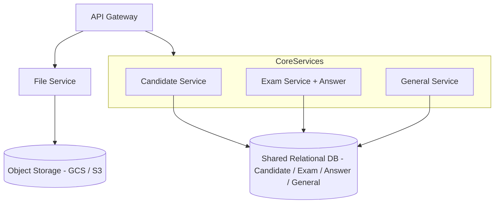

# 領域驅動設計 (DDD) 與微服務治理實例

## 一、DDD 是什麼？
**領域驅動設計 (Domain-Driven Design, DDD)** 是一種軟體設計方法，重點在於：
- **以業務領域為核心**：將系統切分為多個「領域 (Domain)」，而不是僅僅依照技術或資料庫結構來劃分。
- **強調語言一致性 (Ubiquitous Language)**：開發人員與業務人員使用相同的詞彙，避免溝通落差。
- **明確的邊界 (Bounded Context)**：不同領域之間界線清楚，避免耦合，彼此以介面或 API 溝通。

DDD 的核心思想：  
> **程式碼結構應該反映業務邏輯，而非僅僅反映資料庫或框架。**

---

## 二、DDD 的幾個核心概念

### 1. Entity (實體)
具備唯一身份標識 (ID)，生命周期長。例如：**考生(Candidate)**、**考試(Exam)**。

### 2. Value Object (值物件)
沒有唯一 ID，代表某種屬性組合。例如：**Email 地址、完成時間**。

### 3. Aggregate (聚合)
由多個 Entity 和 Value Object 組合而成，形成一個整體，對外以聚合根 (Aggregate Root) 作為存取入口。
例如：**Exam 聚合** = 考卷(ExamEntity) + 題目(ExamKindEntity) + 答案(AnswerEntity)。

### 4. Repository (儲存庫)
對外提供存取聚合的介面，隱藏資料存取細節 (JPA、SQL、NoSQL)。

### 5. Service (領域服務)
封裝業務邏輯，不隸屬於某個特定 Entity。例如：**建立隨機碼**、**考卷評分**。

### 6. Bounded Context (界限上下文)
清楚定義一個領域的邊界，避免跨領域耦合。不同 Context 透過 API 或事件整合。

---

## 三、從單體到微服務的演進

### 1. 單體式架構
- 一個 Controller 包含 Candidate、Exam、Answer、File、School 等所有功能。
- 問題：耦合過高，開發維護困難。

### 2. 模組化單體
- 將程式碼依照 **領域** 拆分為多個模組 (Candidate, Exam, File...)。
- 資料庫仍然共用，但程式邏輯開始有清晰邊界。

### 3. 微服務架構
- 每個 Bounded Context 變成獨立微服務。
- 各自擁有 Repository、Service、API 層。  
- 跨服務溝通透過 REST API 或事件。

---

## 四、專案實例：考試系統的微服務拆分

假設我們的系統包含：考生、考卷、題目、答案、檔案、學校等功能。  
原本 Controller 內有 **20 支 API 全部混在一起**，維護成本高。

依照 DDD 的 Bounded Context，我們可以拆成以下微服務：

### 1. Candidate Service (考生服務)
- **核心職責**：管理考生資訊與考試狀態。
- **聚合根**：CandidateEntity
- **API 範例**：
  - `POST /candidate/createRandom` → 建立考試隨機碼
  - `POST /candidate/saveFinishTime` → 儲存考生完成時間

---

### 2. Exam Service (考卷服務)
- **核心職責**：管理試卷與題目。
- **聚合根**：ExamEntity
- **子實體**：ExamKindEntity (題目)、AnswerEntity (答案)
- **API 範例**：
  - `POST /exam/create` → 建立試卷
  - `POST /exam/update` → 修改題目
  - `POST /exam/getAll` → 查詢所有考卷
  - `POST /answer/save` → 儲存考生答案

---

### 3. File Service (檔案服務)
- **核心職責**：負責考生上傳的語音與圖片。
- **存儲特性**：高 I/O，適合接物件儲存（GCS / S3）。
- **API 範例**：
  - `POST /file/saveVoice`
  - `GET /file/getVoice`
  - `POST /file/saveImage`
  - `GET /file/getImage`

👉 與其他服務不同，這裡不進入關聯式資料庫，而是直接與 GCS/S3 溝通，僅在主資料庫存放檔案的 **Metadata**。

---

### 4. General Service (一般資料服務)
- **核心職責**：提供基礎靜態資料。
- **子領域**：學校(School)、語言(Language)
- **API 範例**：
  - `POST /general/getAllSchool`
  - `POST /general/getAllLocal`
  - `GET /general/language`

---

## 五、資料庫策略

- **短期與中期**：所有業務資料 (Candidate、Exam、Answer、General) **共用同一個關聯式資料庫**。  
- **File Service**：檔案實體存於 **GCS/S3**，僅將 metadata（檔名、路徑、所屬考生 ID）存於主資料庫。  

👉 好處：  
- 減少資料庫數量，維護成本低。  
- ACID transaction 仍然適用，確保資料一致性。  
- 將高 I/O 的檔案分離，避免拖慢主資料庫效能。  

---

## 六、治理原則

1. **服務內高內聚**：Exam 與 Answer 放在一起。  
2. **服務間低耦合**：Candidate 與 Exam 分開，透過 API 溝通。  
3. **共用資料庫策略**：所有業務領域共用同一 DB，File Service 例外，使用物件儲存。  
4. **API 分組清晰**：Swagger tags 與 URL 路徑對應領域。

---

## 七、結論

DDD 並不是一開始就要把所有服務拆到極細，而是：
- **先劃分領域 (Bounded Context)**，讓程式碼結構與業務語言一致。  
- **再依照業務需求與流量特性**，逐步把不同 Context 演進成獨立微服務。  

在本專案的實例中：  
- **Exam + Answer → 核心微服務，共用主 DB**  
- **Candidate → 獨立服務，但仍共用主 DB**  
- **File → 獨立高 I/O 微服務，存取 GCS/S3**  
- **General → 輕量支援服務，共用主 DB**  

這樣設計既能保持彈性，又不會因為「表才 7 張」就過度拆分，維持平衡。

---

## 八、微服務架構圖

---
## 九、ERD VS DDD
# ERD 與 DDD 聚合設計的差異

## 一、前言

在系統設計時，常見的兩種思維模式是 **ERD（Entity-Relationship
Diagram，資料庫設計圖）** 與 **DDD（Domain-Driven
Design，領域驅動設計）**。\
雖然這兩者在圖形上經常長得很像，但實際上強調的觀點完全不同。

本文將以考試系統的
`Exam`（考卷）、`ExamKind`（題目）、`Answer`（答案）為例，對比 ERD 與
DDD 的差異，並討論在何時適合使用 ERD，何時適合使用 DDD。

------------------------------------------------------------------------

## 二、ERD 的思維模式

### 著眼點

-   **資料結構**與**正規化**。\
-   目的是確保資料表之間關聯正確，避免冗餘。

### 表現方式

-   一張主表：`Exam`\
-   兩張附表：`ExamKind`（題目）、`Answer`（答案）\
-   關聯透過外鍵維持：
    -   `ExamKind.exam_id -> Exam.id`\
    -   `Answer.exam_id -> Exam.id`

### 特點

-   強調資料如何被 **儲存**。\
-   誰都能直接查或修改子表。\
-   常用 JOIN 查詢跨表資料。

### 適用情境

-   以 **資料管理為核心** 的系統：報表、資料倉儲、後台管理工具。\
-   例子：學校資料庫（學生表、課程表、成績表），以查詢和報表統計為主要需求。

------------------------------------------------------------------------

## 三、DDD 的思維模式

### 著眼點

-   **業務邊界**與**一致性規則**。\
-   目的是確保系統操作符合業務語意，而不是僅僅修改資料。

### 聚合設計

-   **聚合根 (Aggregate Root)**：`ExamEntity`

    -   唯一入口，負責考試整體邏輯。\

-   **子實體 (Entity)**：

    -   `ExamKindEntity`（題目）\
    -   `AnswerEntity`（答案）\

-   所有修改必須透過 `ExamEntity`：

    ``` java
    exam.addAnswer(new Answer(...));
    examService.save(exam);
    ```


### 特點

-   強調誰能修改誰。\
-   子實體不能獨立存在，必須依附於聚合根。\
-   **不建議跨聚合直接操作或 JOIN**，而是透過應用服務 / API 協作。

### 適用情境

-   業務邏輯複雜，需要 **封裝規則**、**確保一致性**。\
-   例子：考試系統（考卷 Exam 聚合，包含題目和答案），需要控制：
    -   考試狀態（未開始、進行中、完成）。\
    -   考生是否允許修改答案。\
    -   成績計算與驗證。

------------------------------------------------------------------------

## 四、範例比較

  面向       ERD 思維                     DDD 聚合思維
  ---------- ---------------------------- -----------------------------
  著眼點     資料結構、表設計             業務邊界、一致性
  誰能操作   任何人直接查/改子表          只能透過聚合根 (ExamEntity)
  主要手段   外鍵、JOIN                   方法封裝 (exam.addAnswer)
  驅動邏輯   資料正規化                   業務規則
  適用情境   報表、資料倉儲、簡單 CRUD    複雜業務邏輯、狀態控制
  實例       `Answer.exam_id = Exam.id`   `exam.addAnswer(answer)`

------------------------------------------------------------------------

## 五、何時用 ERD，何時用 DDD？

### 選擇 ERD 的時機

-   系統以 **資料正確儲存與查詢** 為主要目的。\
-   資料邏輯簡單，幾乎沒有跨表的業務規則。\
-   例如：學生成績系統，主要需求是匯出報表，邏輯只依賴 SQL JOIN。

### 選擇 DDD 的時機

-   系統以 **業務操作與一致性** 為主要目的。\
-   涉及流程控制、狀態轉換、業務規則。\
-   例如：考試系統，必須保證「只能在考試進行中提交答案」，「完成後不能修改答案」。

------------------------------------------------------------------------

## 六、結論

-   **ERD**：偏向 **資料庫設計**，適合確保資料儲存正確。\
-   **DDD 聚合**：偏向 **業務建模**，適合確保操作符合領域規則。\
-   兩者並不衝突，而是 **不同層面的抽象**。
    -   ERD → 關心「資料表如何關聯」。\
    -   DDD → 關心「業務邏輯如何封裝」。

在實務上，**你可以先用 ERD 設計資料表，再用 DDD 定義業務邊界**。\
最終，資料庫只是「儲存的技術細節」，而 DDD 才是「業務語意的保證」。